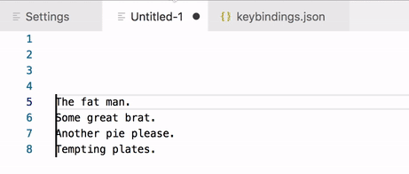

# multi-cursor-search

Performs a search starting after each cursor. If a result is found, the cursor is moved to select the result. Basically acts just like a normal search but is repeated for each cursor.

Supports both plain and RegExp searches.

## Features

### Multi-Cursor Search

## Extension Commands

 Command                                  | Description
------------------------------------------|-------------
`yo1dog.multi-cursor-search.plainSearch`  | Perform plain search.
`yo1dog.multi-cursor-search.regexpSearch` | Perform RegExp search.

If you prefer RegExp searches over plain searches, you can switch the default keybindings.

## Extension Configuration

 Configuration                              | Description
--------------------------------------------|-------------
`multiCursorSearch.plainSearch.ignoreCase`  | Specifies if case should be ignored when performing **plain searches**. Internaly, this enables the `i` RegExp flag.
`multiCursorSearch.regexpSearch.ignoreCase` | Specifies if the ignore case (`i`) flag should be used when performing **RegExp searches**.
`multiCursorSearch.regexpSearch.multiline`  | Specifies if the multiline (`m`) flag should be used when performing **RegExp searches**.
`multiCursorSearch.regexpSearch.dotAll`     | Specifies if the "dotAll" (`s`) flag should be used when performing **RegExp searches**.

See the [JavaScript RegExp docs](https://developer.mozilla.org/en-US/docs/Web/JavaScript/Reference/Global_Objects/RegExp#Parameters) for more details on the RegExp flags.

## Implementation Details

Searches begin after cursors/selections. There is currently no support for searching within selections. If there are no results, the cursor does not move. If multiple cursors have the same result, they are collapsed into a single selection.

When using `^` in RegExp searches, remember that because the search starts after the cursor it will first match the cursor's position.

## alt+f Not Working?

The default `alt+f`/`alt+shift+f` keybinding may be captured higher up (ex: at the OS level). Try changing the keybinding.

If you continue to have problems, please open a new issue [here](https://github.com/yo1dog/vscode-multi-cursor-search/issues).

## Known Issues

See [Issues](https://github.com/yo1dog/vscode-multi-cursor-search/issues).

## Release Notes

See [CHANGELOG.md](CHANGELOG.md)