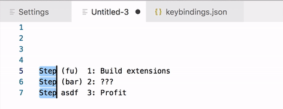

# Multi-Cursor Search

Performs a search starting after each cursor. Basically acts just like a normal search but is repeated for each cursor.

Supports both plain and regex searches.

## Features

### Search Abilities
 * Plain searches.
 * Regex searches.
   * Customize flags using configuration.
 * Advanced searches.
   * Regex searches with extra dialogs to specify flags and result selection type.

### Selection Abilities
 * Select results.
 * Select between cursors and results.
 * Expand cursors/selections to include results.
 
### Select results:

### Select between cursors and results:

### Advanced search:

## Extension Commands

 Command                                              | Description
------------------------------------------------------|-------------
`yo1dog.multi-cursor-search.plainSearch`              | Perform plain search and select results.
`yo1dog.multi-cursor-search.plainSearchSelectBetween` | Perform plain search and select text between cursors and results.
`yo1dog.multi-cursor-search.regexSearch`              | Perform regex search.
`yo1dog.multi-cursor-search.regexSearchSelectBetween` | Perform regex search and select text between cursors and results.
`yo1dog.multi-cursor-search.advancedSearch`           | Perform advanced search.

If you prefer regex searches over plain searches, you can switch the default keybindings.

## Extension Configuration

 Configuration                             | Description
-------------------------------------------|-------------
`multiCursorSearch.plainSearch.ignoreCase` | Specifies if case should be ignored when performing **plain searches**. Internaly, this enables the `i` regex flag.
`multiCursorSearch.regexSearch.ignoreCase` | Specifies if the ignore case (`i`) flag should be used when performing **regex searches**.
`multiCursorSearch.regexSearch.multiline`  | Specifies if the multiline (`m`) flag should be used when performing **regex searches**.
`multiCursorSearch.regexSearch.dotAll`     | Specifies if the "dotAll" (`s`) flag should be used when performing **regex searches**.

See the [JavaScript RegExp docs](https://developer.mozilla.org/en-US/docs/Web/JavaScript/Reference/Global_Objects/RegExp#Parameters) for more details on the regex flags.

## Implementation Details

Searches begin after cursors/selections. There is currently no support for searching within selections. If there are no results, the cursor does not move. If multiple cursors have the same result or overlap they are collapsed into a single selection.

When using `^` in regex searches, remember that because the search starts after the cursor it will first match the cursor's position.

## Keybindings Not Working?

The default keybindings may be captured higher up (ex: at the OS level). Try changing the keybinding.

If you continue to have problems, please open a new issue [here](https://github.com/yo1dog/vscode-multi-cursor-search/issues).

## Known Issues

See [Issues](https://github.com/yo1dog/vscode-multi-cursor-search/issues).

## Release Notes

See [CHANGELOG.md](CHANGELOG.md)